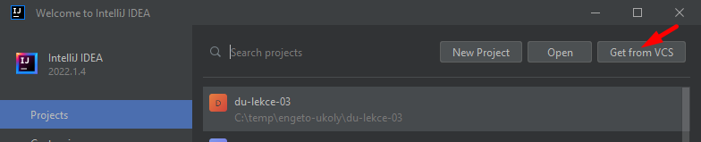
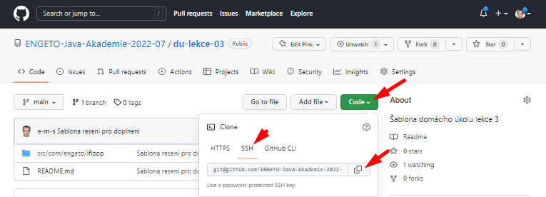
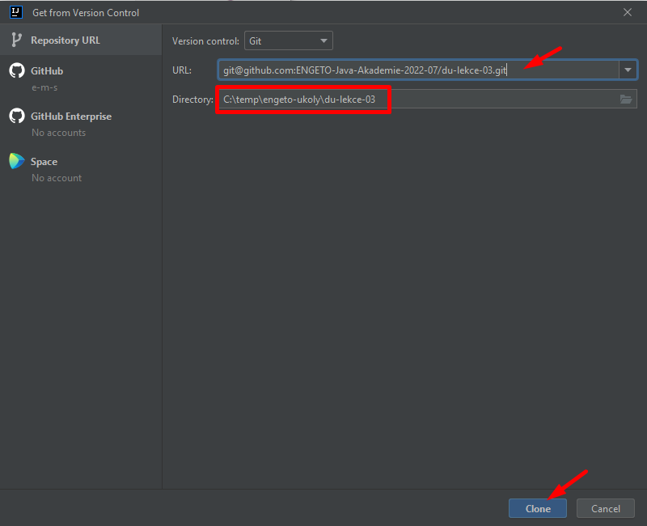
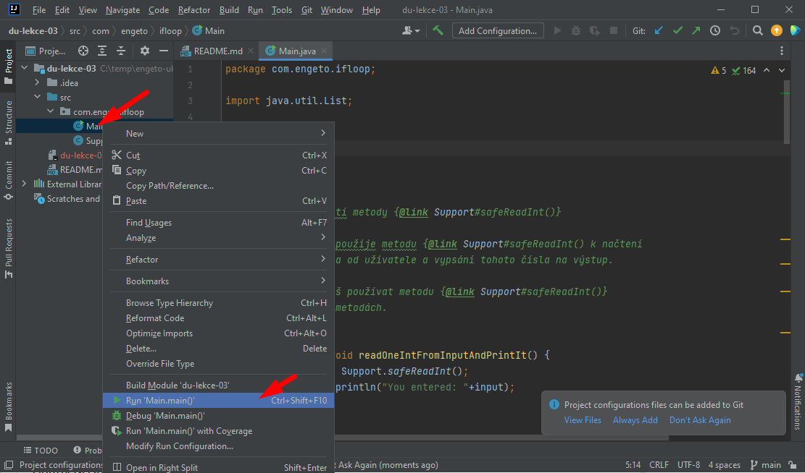
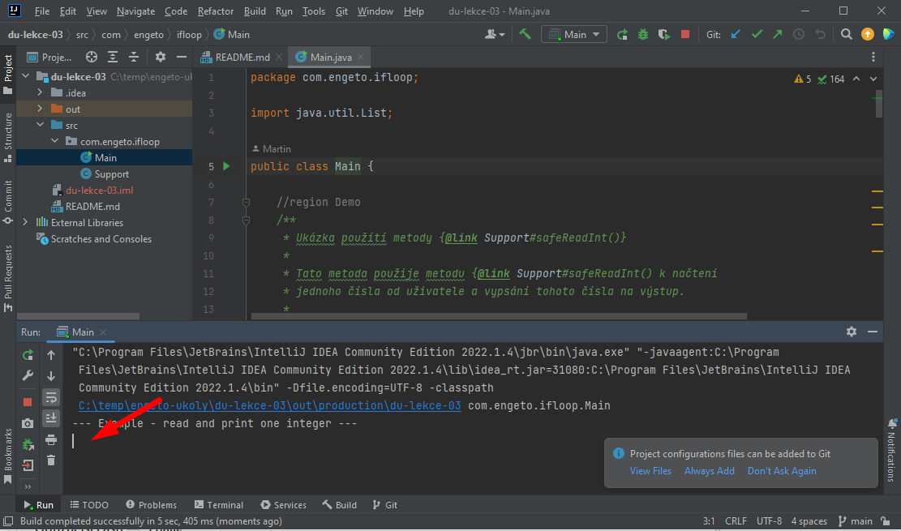
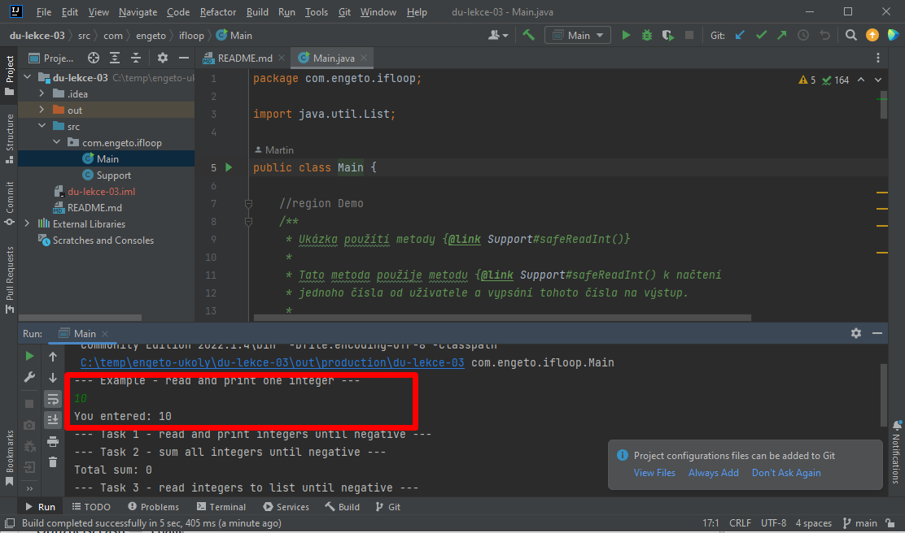

# Domácí úkol &mdash; podmínky, cykly, switch

Zápis cyklů a&nbsp;podmínek si procvičíš na projektu, kde požádáme uživatele o&nbsp;zadávání čísel z&nbsp;klávesnice a&nbsp;takto zadaná čísla budeme zpracovávat.

Tvým úkolem je dopsat těla (kód) metod podle popisu v&nbsp;komentářích.

Protože čtení z&nbsp;klávesnice zatím neumíme, připravili jsme ti třídu `Support` s&nbsp;metodou `Support.safeReadInt()`, která načte z&nbsp;klávesnice jedno číslo a&nbsp;vrátí ho jako návratovou hodnotu. V&nbsp;úlohách můžeš tuto metodu využít.

## Postup stažení šablony projektu

Doporučujeme otevřít projekt z&nbsp;repozitáře:
1. Otevři IntelliJ IDEA (případně zavři otevřený projekt pomocí _File &rarr; Close_).
2. Zvol _Get from VCS_: 
    
3. Zadej adresu tohoto repozitáře: `git@github.com:ENGETO-Java-Akademie-2022-07/du-lekce-03.git` 
    Adresu repozitáře najdeš také na GitHubu: 
     
4. Naklonuj repozitář: 
    Do kolonky "Directory" zapiš cestu k&nbsp;adresáři, kde máš své projekty. 
    _(Obvykle by ji IntelliJ mělo vyplnit samo podle předchozího nastavení.)_
    
5. Najdi si třídu `Main`. IDEA tě požádá o nastavení SDK: 
    _(Nabízené SDK se můžou u tebe lišit od obrázku podle toho, jaké máš nainstalovány.)_
    
6. Nyní již můžeš psát kód a spouštět ho.
    

PS: Takto si můžeš otevřít jakýkoli repozitář z&nbsp;GitHubu.

Nebo si prostě stáhni projekt ručně: 
- vytvoř svůj projekt s&nbsp;balíčkem (package) `com.engeto.ifloop`
- zkopíruj do něj obsah souborů: 
[Support.java](src/com/engeto/ifloop/Support.java)
 a&nbsp;[Main.java](src/com/engeto/ifloop/Main.java)
- případně oprav název balíčku na prvním řádku tak, aby odpovídal tvému projektu.

## Zadání

- Doplň těla všech metod podle popisu v&nbsp;komentářích.

- Ve výsledku by každá metoda měla plnit to, co je popsáno v&nbsp;jejím komentáři.

- Metody mají číst vstup z&nbsp;klávesnice. Ten budeš zadávat do okna spuštěné aplikace: 
         
        

## Obtížnější části &mdash; na co si dát pozor!
1. V&nbsp;listu by nemělo být uloženo záporné číslo, kterým jsme ukončili vstup.

---
